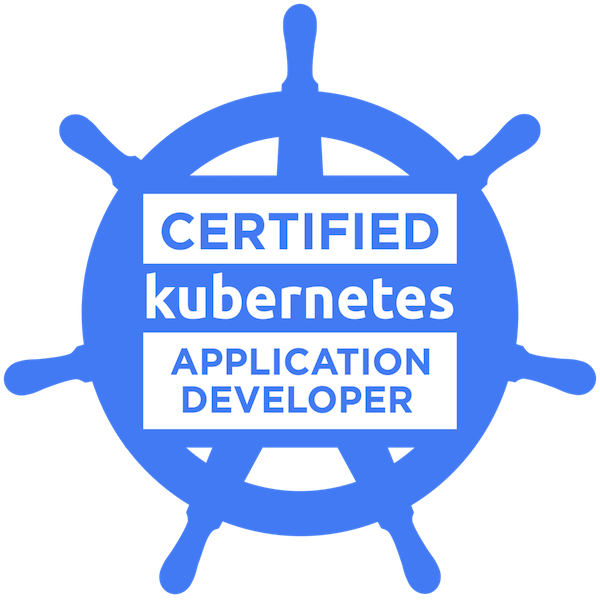

<!-- Social Section -->

### Hi there 👋
#### I'm a Principal Solutions Architect based in Chicago.

##### BIO

- 🏢 I'm currently working at **Red Hat**
- 🌱 Working with **Automation, Kubernetes and Cloud-native tech**
- ⚡️ I love Kettlebelling, BBQ, and Coffee.
- ✔️ You can see my body of work (talks, blog entries, projects) [here](https://github.com/michaelford85/my-work).

##### Certifications
<!-- 

  

 -->
- [Certified Kubernetes Application Developer](https://www.credly.com/badges/eab9de0c-9af9-400e-898a-b4a9244cd2a4/public_url)
- [AWS Certified Solutions Architect – Associate](https://www.credly.com/badges/76b44f4a-6a6e-4cda-9676-a9b2b82220de/public_url)

<!--
**michaelford85/michaelford85** is a ✨ _special_ ✨ repository because its `README.md` (this file) appears on your GitHub profile.

Here are some ideas to get you started:

- 🔭 I’m currently working on ...
- 🌱 I’m currently learning ...
- 👯 I’m looking to collaborate on ...
- 🤔 I’m looking for help with ...
- 💬 Ask me about ...
- 📫 How to reach me: ...
- 😄 Pronouns: ...
- ⚡ Fun fact: ...
-->
